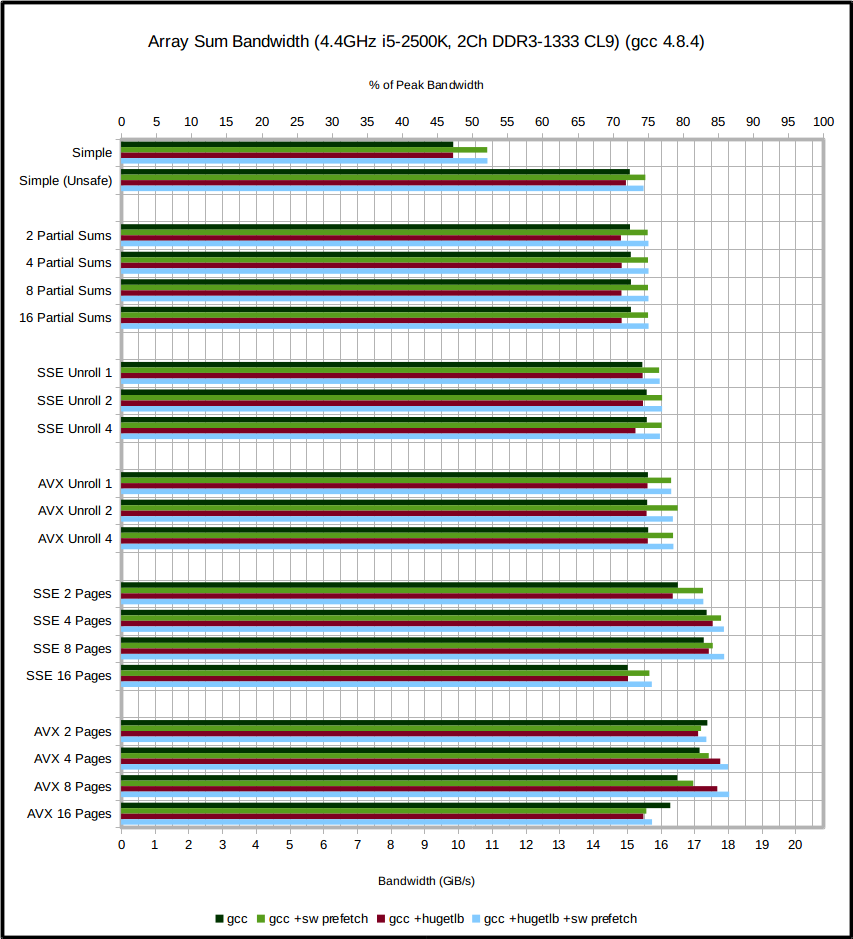
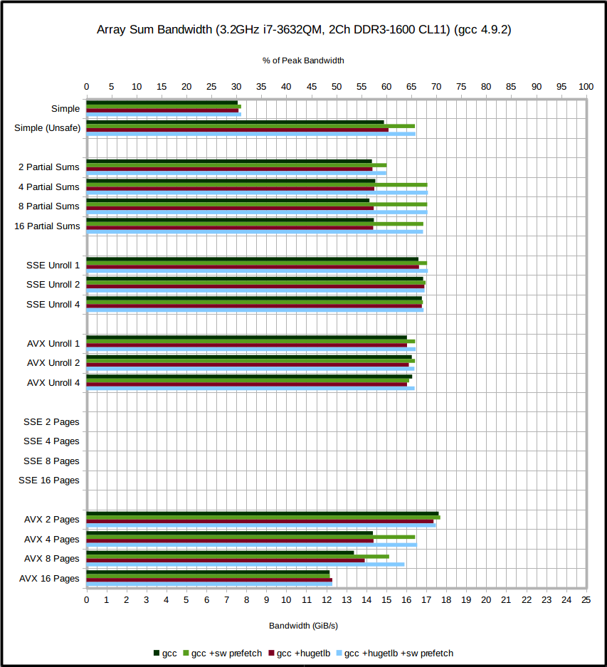
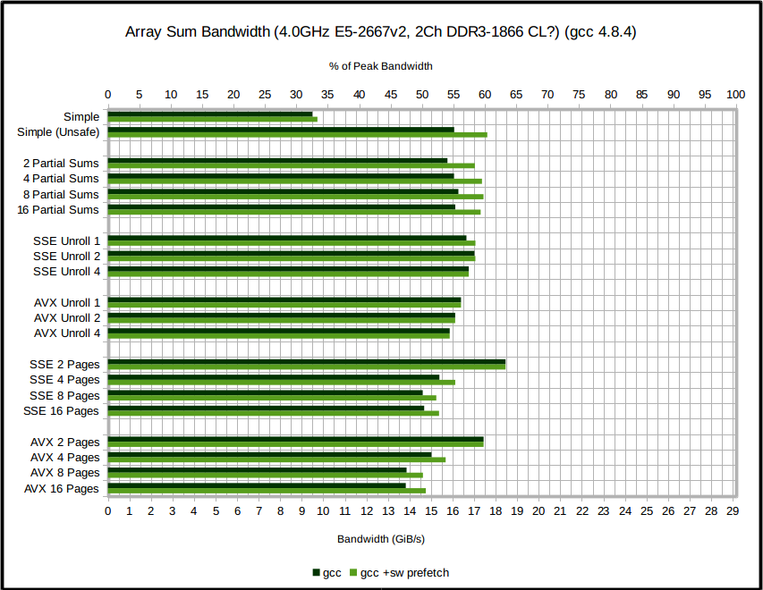

# dot-product

How fast can we compute the dot product of two (large) vectors? By *large*, we mean *many times larger than L3 cache*. The performance will therefore be limited by how quickly we can access DRAM.

Systems using dual-channel DDR(2,3,4)-N have a peak theoretical memory bandwidth of N * (64 bits) * (2 channels) / 8 / 1024 GiB/s.

In all cases, we use the highest possible optimization level of the compiler (`-Ofast` for `gcc`, `-O3` for `icc`) but *disallow* floating-point unsafe optimizations (`-fno-unsafe-math-optimizations` for `gcc`, `-fp-model precise` for `icc`). This will severely limit the optimizations the compiler can perform on this code, since it cannot re-order floating point calculations. When allowing such optimizations makes a large difference, it will be discussed. Additionally, tests are run with as few other programs running as possible, including the desktop environment. This improves performance by a few percent, and decreaces the variance of the measurements.


## Array Sum
Begin by considering the simpler case of summing the elements of a single large array. Results for `gcc` are as graphed (`icc` produces very similar performance), with some explanation of each test below.

Sandy Bridge:




Ivy Bridge:





#### Simple
Here we simply loop over `sum += array[i]` (unrolled by two cache lines). This produces by far the worst performing code. It is not vectorized by `gcc` or `icc` (as expected) and acheives only ~45% peak memory bandwidth.

*(If we allow unsafe float optimizations, however, things improve a lot. We now see over 70% peak bandwidth. `gcc` and `icc` use packed AVX instructions to add 4 doubles in parallel. This somewhat equivalent to using 4 partial sums, see below.)*


#### Partial Sums
The problem with the previous method is that we have a single summation variable, to which we add with a loop carried dependence. It takes 8 sequential additions (24 cycles) to exhaust the current cache-line (of 64 bytes), and we then have to load another from DRAM. It would be preferrable to load a cache-line from DRAM *every* loop iteration. We can achieve this by using more summation variables to hide the addition latency. Four variables are sufficient on modern hardware. Using the loop
```c
for (int i = 0; i < arraySize; i+=8) {
	sum0 += array[i+0];
	sum1 += array[i+1];
	sum2 += array[i+2];
	sum3 += array[i+3];
	sum0 += array[i+4];
	sum1 += array[i+5];
	sum2 += array[i+6];
	sum3 += array[i+7];
}
```
we sum an entire cache line with only 8 cycles spent in addition.

If the compiler manages to vectorize the code, two (or four) of the summation variables can be combined into a single SSE (or AVX) vector, and the number of partial sums is no longer sufficient to hide the addition latency.

*(Here, neither `gcc` nor `icc` vectorize the loop without unsafe float optimizations, despite that fact that it can be done without re-ordering any float operations).*


#### Explicit Vectorization
We now turn to vector intrinsics to explicitly vectorize the sum. This means we'll have vectorized code without enabling unsafe float optimizations, and the produced code will be much cleaner than autovectorized code. We try both SSE and AVX intrinsics.

Vectorized code means that we spend fewer cycles on addition per array element, since modern (AVX supporting) CPUs can add 4 doubles in a single instruction. At this point, we have already considered the latency of the addition operations and tried to cover it using partial sums, so we expect only a *minimal improvement* by vectorizing.

At this point, enabling unsafe float optimizations make no difference, or make the code *slower*.


#### How does DRAM work?
To make any further progress, we need to examine carefully how exactly DRAM works.

The DRAM in the test systems is *dual rank*. Each rank consists of 8 *banks*, which contain an array of bytes. When we read from DRAM, we read 1KB from each bank, forming an 8KB *page*. This page is transferred to *sense amplifiers* from which the data is transferred to the CPU. Further accesses from the same page are now cheap, as it does not have to be loaded into the sense amps again. *(This is why sequential access is faster than random access -- we don't have to load a new page so often). (This is ALSO why the CPU's hardware prefetcher only prefetches within the open 8KB page -- swapping pages to prefetch further could reduce performance).*

The two ranks can be accessed in parallel. We therefore want to read data from multiple pages at the same time. We can re-structure the loop such that we access the array in this way. The code now has fairly strict requirements on the size of the array we are summing (it must be a multiple of concurrent pages * memory page size) but this is just a proof-of-concept.

The reason that accessing *4* pages seems to improve performance is that we have 2 memory *channels* -- each with its own DIMM of two ranks. Above 4 pages, performance should drop.?????? DOES IT? YES UNLESS PREFETCHING.


#### Software Prefetching
To try and further saturate the memory controller we can insert software prefetch instructions into the loops. When the loop reaches the prefetched location, it will find the data in L1 cache and not have to request it from DRAM.

The optimizations were designed to hide the addition latency as much as possible, and make memory requests every cycle. The CPU is occasionally interrupted by other threads, however, so adding software prefetches means we have more outstanding memory requests that can fill these gaps. ???????????


#### Huge Pages
If we allocate memory with mmap, and request HUGE_TLB, the OS will give us huge (2MB) pages (these must already have been allocated). Linux's memory pages are stored contiguously in physical memory, but the pages themselves are not necessarily contiguous.

By using 2MB OS pages, the concurrent access of multiple physical memory pages can be more properly realised. The contiguous 2MB chunk of memory is shared, in 8KB physical memory pages, around the ranks and channels of the DIMMs. Accessing the 8KB physical pages in parallel is now more likely to access ranks in parallel as intended.

As the chart shows, this makes a negligible difference in most tests, but in the final tests, in which we read from 4 or 8 pages in parallel, it helps significantly.


#### Effects of memory frequency and CAS latency
The cas latency determines how long we must wait (in memory cycles) to retrieve data from an *open page*, that is, a page in the sense amps. Since we are in principle reading full open pages per rank, this should make the biggest difference of the different memory latencies.

In fact, this difference is very small. The table shows the % of theoretical peak bandwidth (12.5, 16.66, 20.83 GB/s for DDR3-800, DDR3-1066, DDR3-1333 respectively) achieved by the AVX 8 Pages test, for different frequencies and CAS latencies:

CAS Latency | DDR3-800 | DDR3-1066 | DDR3-1333
-----------:|---------:|----------:|---------:
5           | 90.42		
6			| 90.39		
7			| 90.06|89.60
8			| 89.68|89.20|86.88
9			| 89.22|88.52|86.58
10          | 88.78|88.27|86.11


#### Effects of CPU frequency
In the charts, we see a large difference between the % of peak theoretical bandwidth achieved by the DDR3-1333-CL9 system and the DDR3-1600-CL11. How much of this is attributable to the large difference in CPU frequency? Although the computation part of the loop (the addition) should be a small fraction of the total time (the code is severely DRAM bandwidth constrained), the more highly clocked CPU will be getting through it more quickly, and therefore issuing memory read requests more often.

We observe a small difference, but not large enough to explain the 

% of Highest Freq (4.4) | % of Best Perf. | Bandwidth (GB/s)
-----------------------:|----------------:|-----------------:
77.27 (3.4)	            | 97.29           | 17.546=
81.82 (3.6)             | 97.09           | 17.51
90.91 (4.0)             | 98.78           | 17.815
100.00 (4.4)            | 100.00          | 18.035


